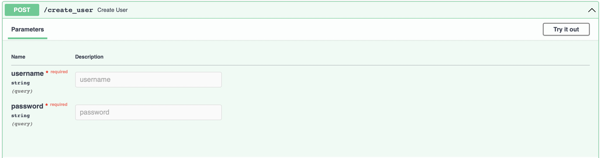
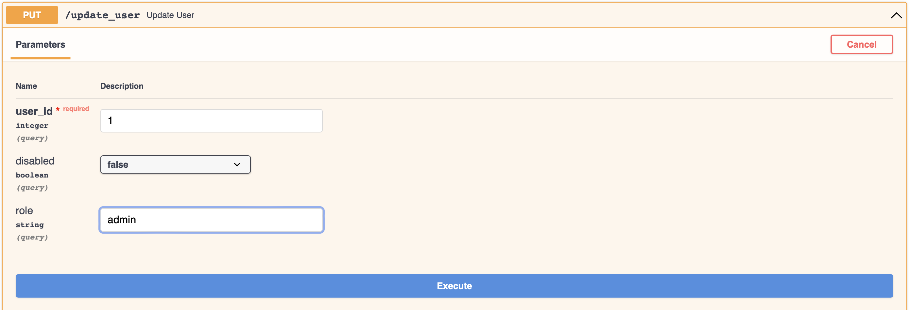
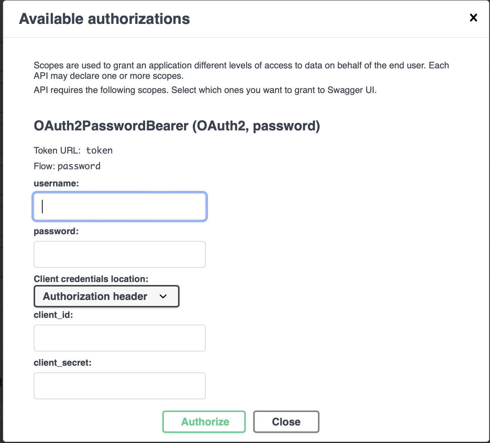
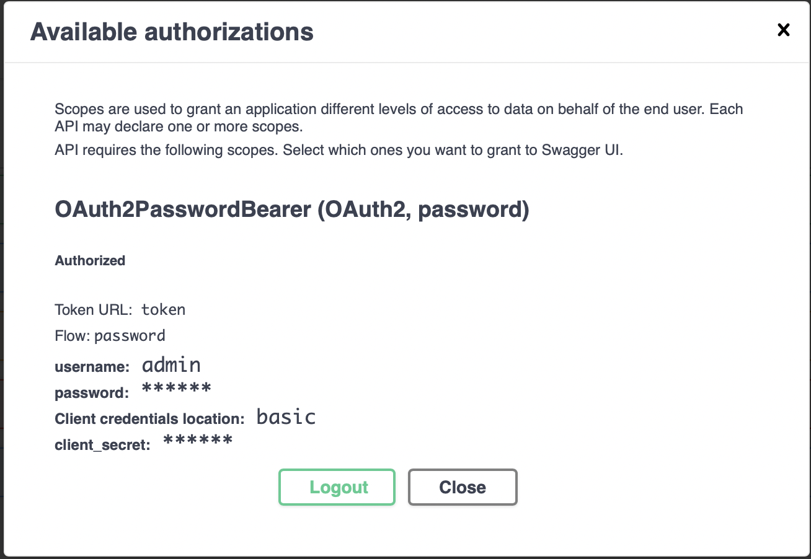
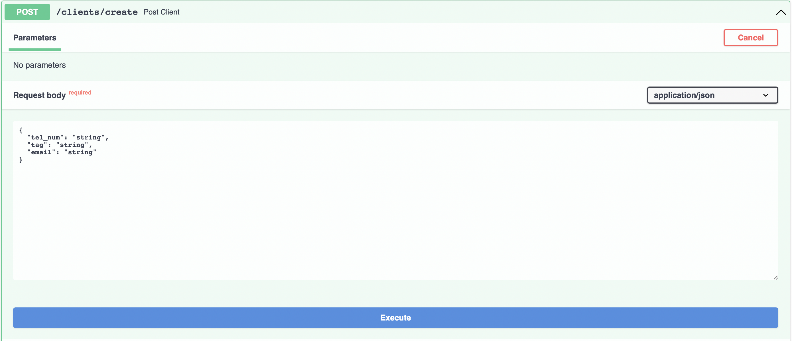
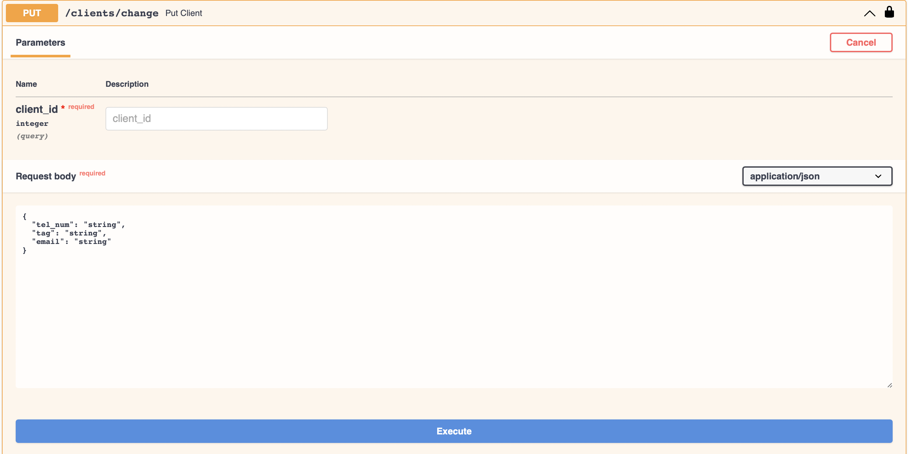
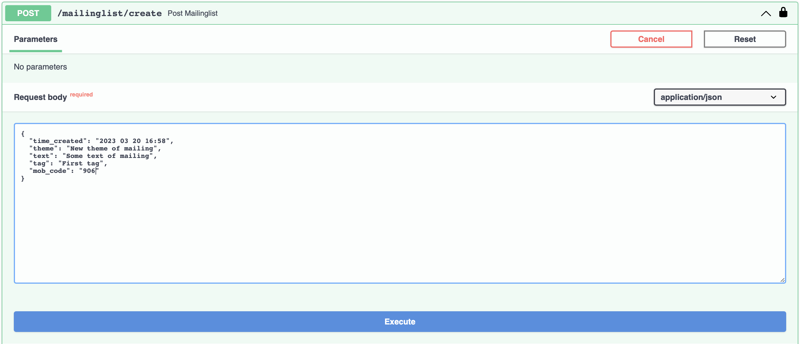
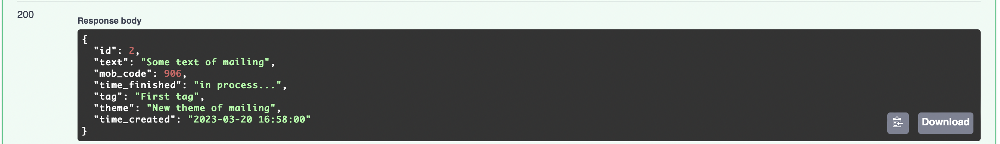
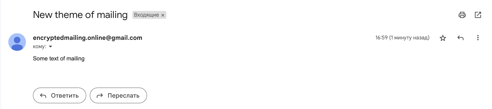

    
    
    
    
    
    
    
    
    
    

# Cервис управления рассылками API администрирования и получения статистики.

• Реализованы методы создания рассылок, просмотра созданных и получения статистики по выполненным рассылкам.

• Реализован сам сервис отправки уведомлений на почту пользователей.

• Реализован ролевой доступ к API-методам в зависимости от уровня прав пользователя.

• Настроена валидация данных.

• Подготовлен docker-контейнер с сервисами.

• Настроен Traefik.

• Сервис находится по адресу: [https://encryptedmailing.online/docs#/](https://encryptedmailing.online/docs#/)

**Спроектированы и реализованы API для:**

• Добавления нового клиента в справочник со всеми его атрибутами

• Обновления данных атрибутов клиента

• Удаления клиента из справочника

• Добавления новой рассылки со всеми её атрибутами

• Получения общей статистики по созданным рассылкам и количеству отправленных сообщений по ним с группировкой по статусам

• Получения детальной статистики отправленных сообщений по конкретной рассылке

• Обновления атрибутов рассылки

• Удаления рассылки

• Обработки активных рассылок и отправки сообщений клиентам

**Логика рассылки:**

• После создания новой рассылки, если текущее время больше времени начала и меньше времени окончания - должны быть выбраны из справочника все клиенты, которые подходят под значения фильтра, указанного в этой рассылке и запущена отправка для всех этих клиентов.

• Если создаётся рассылка с временем старта в будущем - отправка должна стартовать автоматически по наступлению этого времени без дополнительных действий со стороны пользователя системы.

• По ходу отправки сообщений собирается статистика по каждому сообщению для последующего формирования отчётов.

• Клонируем репозиторий:

    git clone https://github.com/Mitsufiro/fastapi_celery

• Разворачиваем контейнер:

    docker-compose up
• Создаем миграцию:

    docker exec fastapi_celery_web_1 alembic revision --autogenerate -m "New Migration"
____________________________
    docker exec fastapi_celery_web_1 alembic upgrade head

• Создайте админ-пользователя:

• Определите своему пользователю права администатора id: 1 role: admin

• Авторизуйтесь

• Создайте клиентов введя номер телефона, произвольный тег и существующую почту чтобы убедиться что рассылка работает.

• Метод внесения изменений клиенту.

• Теперь можно создать рассылку.

• Проверяем почту.

